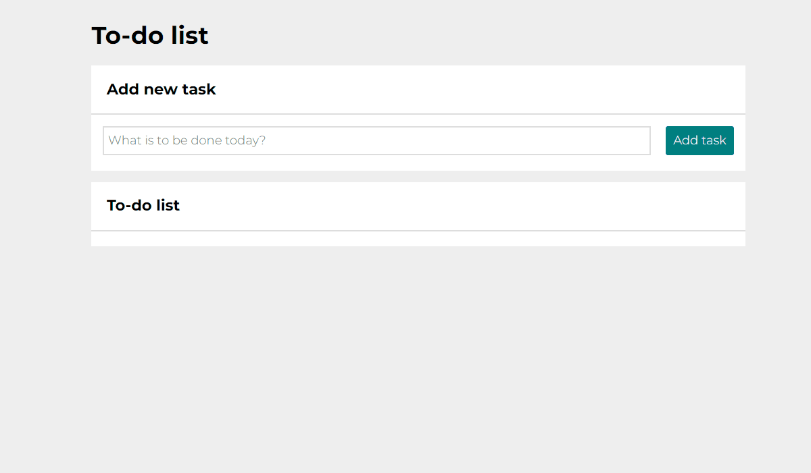

# To-Do List

## Table of content
- [Demo](#Demo)
- [General info](#general-info)
- [How it works?](#how-it-works)
- [Technologies/Conventions I used](#TechnologiesConventions-I-used)

## Demo
https://galerafrontend.github.io/ToDo-List/

## General info
Project is a simple example of to do list. It allows to create list of tasks and manipulated it freely. Project is easy and fun to use.
## How it works?
1. At first, enter any task in a text field and then press the add task button.
As you can see the new task has been added to the list and the focus is automatically set in text field.
2. Now you can add another task or if the current task has been completed, press green button. Completed task will be crossed out. Of course you can reverse the process by pressing the green button again.
3. A completed task can alco be completly removed from the list. To do this, press the red button with a wastebasket icon.
4. You can use two special buttons as well. The first one turns on when at least one of the tasks has been completed, then the button can be used to hide or show completed tasks.
The second, when clicked, sets all tasks as completed, then it is turned off until there is one incomplete task.
5. An example of project's operation has been presented on the GIF.

## Technologies/Conventions I used
Project is created with:
- BEM
- media queries